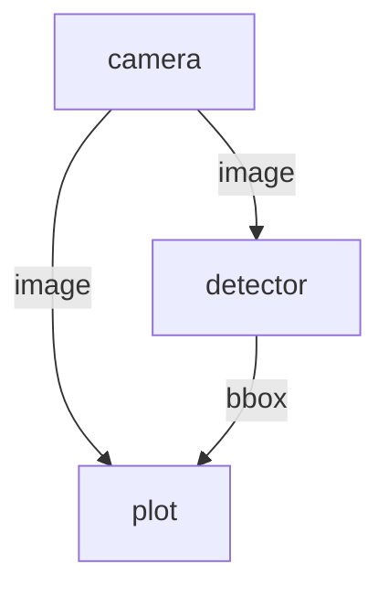

# /visualize Command

Generate a visual representation of your dataflow.

## Usage

```
/visualize [dataflow.yml]
```

## Output

Generates a Mermaid diagram showing:
- Nodes as boxes
- Connections as arrows
- Input/output labels

## Example

For a vision pipeline:
```yaml
nodes:
  - id: camera
    outputs:
      - image
  - id: detector
    inputs:
      image: camera/image
    outputs:
      - bbox
  - id: plot
    inputs:
      image: camera/image
      boxes2d: detector/bbox
```

Generates:


## CLI Alternative

You can also use:
```bash
dora graph dataflow.yml
```
