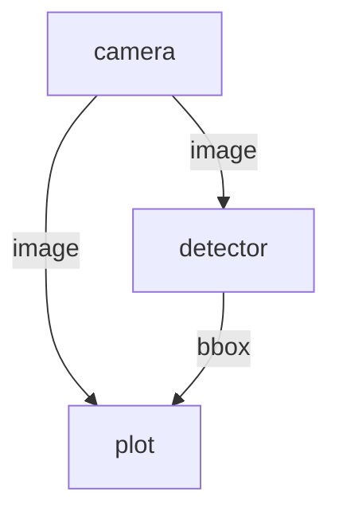

# Dora CLI Commands

> Complete reference for the dora command-line interface

## Installation

```bash
# Via pip (recommended)
pip install dora-rs-cli

# Via cargo
cargo install dora-cli

# Via shell installer (macOS/Linux)
curl --proto '=https' --tlsv1.2 -LsSf \
  https://github.com/dora-rs/dora/releases/latest/download/dora-cli-installer.sh | sh
```

## Command Overview

| Command | Description |
|---------|-------------|
| `dora new` | Create new dataflow, node, or operator |
| `dora build` | Build nodes in a dataflow |
| `dora run` | Run dataflow (standalone mode) |
| `dora up` | Start coordinator and daemon |
| `dora start` | Start dataflow on daemon |
| `dora stop` | Stop running dataflow |
| `dora list` / `dora ps` | List running dataflows |
| `dora logs` | View node logs |
| `dora destroy` | Stop coordinator and daemon |
| `dora check` | Check system status |
| `dora graph` | Generate dataflow visualization |

## Creating Projects

### New Dataflow

```bash
# Create new dataflow project
dora new my_project --kind dataflow

# With Python language
dora new my_project --kind dataflow --lang python

# With Rust language
dora new my_project --kind dataflow --lang rust
```

### New Node

```bash
# Create new Python node
dora new my_node --kind node --lang python

# Create new Rust node
dora new my_node --kind node --lang rust
```

### New Operator

```bash
# Create new operator
dora new my_operator --kind operator --lang rust
```

## Building

```bash
# Build all nodes in dataflow
dora build dataflow.yml

# Build with uv (faster Python packages)
dora build dataflow.yml --uv

# Build specific node
dora build dataflow.yml --node camera
```

## Running Dataflows

### Standalone Mode (dora run)

```bash
# Run dataflow directly (no daemon)
dora run dataflow.yml

# Run with uv for Python packages
dora run dataflow.yml --uv

# Run from URL
dora run https://example.com/dataflow.yml
```

### Daemon Mode

```bash
# Step 1: Start coordinator and daemon
dora up

# Step 2: Start dataflow
dora start dataflow.yml

# Step 3: Check status
dora list

# Step 4: Stop dataflow
dora stop <dataflow-id>

# Step 5: Shutdown daemon
dora destroy
```

## Monitoring

### List Running Dataflows

```bash
# List all running dataflows
dora list
# or
dora ps
```

### View Logs

```bash
# View logs for a node
dora logs <dataflow-id> <node-id>

# Follow logs (like tail -f)
dora logs <dataflow-id> <node-id> --follow
```

### Check System Status

```bash
# Check dora system status
dora check
# or
dora system status
```

## Visualization

```bash
# Generate Mermaid diagram
dora graph dataflow.yml

# Output to file
dora graph dataflow.yml > graph.md
```

Example output:



## Distributed Mode

### Coordinator

```bash
# Start coordinator on custom port
dora coordinator --port 6012
```

### Daemon

```bash
# Connect daemon to remote coordinator
dora daemon --coordinator-addr 192.168.1.100:6012
```

### Remote Dataflow

```yaml
# dataflow.yml with deployment config
nodes:
  - id: camera
    path: camera_node.py
    _unstable_deploy:
      machine: robot-1

  - id: processor
    path: processor_node.py
    _unstable_deploy:
      machine: server-1
```

## Common Workflows

### Development Workflow

```bash
# 1. Create project
dora new my_robot --kind dataflow

# 2. Edit dataflow.yml and create nodes

# 3. Build
dora build dataflow.yml --uv

# 4. Run and test
dora run dataflow.yml --uv

# 5. Stop with Ctrl+C
```

### Production Workflow

```bash
# 1. Start services
dora up

# 2. Deploy dataflow
dora start dataflow.yml

# 3. Monitor
dora list
dora logs <id> <node>

# 4. Update (stop and restart)
dora stop <id>
dora start dataflow.yml

# 5. Shutdown
dora destroy
```

### Remote Dataflow

```bash
# On coordinator machine
dora coordinator

# On each robot/server
dora daemon --coordinator-addr <coordinator-ip>:6012

# Deploy dataflow
dora start dataflow.yml
```

## Environment Variables

| Variable | Description |
|----------|-------------|
| `DORA_COORDINATOR_ADDR` | Coordinator address |
| `DORA_DAEMON_ADDR` | Daemon address |
| `DORA_OTLP_ENDPOINT` | OpenTelemetry endpoint |
| `DORA_JAEGER_TRACING` | Enable Jaeger tracing |

## Troubleshooting

### Common Issues

**"Daemon not running"**
```bash
# Start the daemon
dora up
```

**"Port already in use"**
```bash
# Kill existing processes
dora destroy
# Then restart
dora up
```

**"Build failed"**
```bash
# Check build output
dora build dataflow.yml --uv 2>&1 | tee build.log
```

### Debug Mode

```bash
# Run with debug output
RUST_LOG=debug dora run dataflow.yml
```

## Related Skills

- **dataflow-config** - YAML configuration
- **node-api-rust** - Rust node development
- **node-api-python** - Python node development
